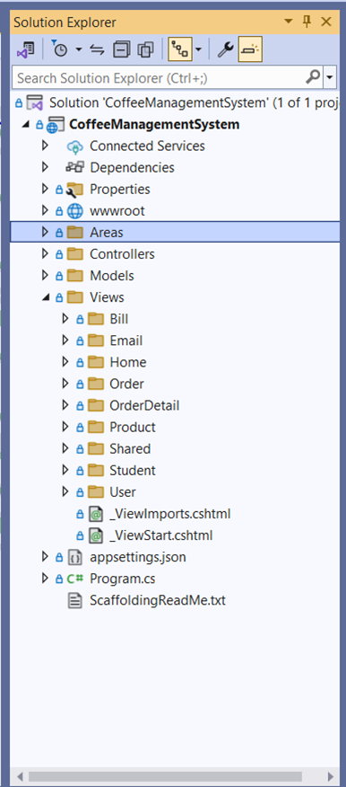

# Steps for Adding Areas in ASP.NET Core MVC

## Step 1: Setup the Project

1. Ensure that the ASP.NET Core MVC framework is correctly installed and your project is set up.
2. Open your project in Visual Studio or your preferred IDE.

## Step 2: Create the Area

1. **Create a New Area**:

   - Right-click on your project and select Add > New Folder.
   - Name the folder `Areas`.
   - At the root level of your project, create a new folder named `Areas`.
   - 
   - Inside the `Areas` folder, create another folder named `Product` (this will be your area).
   - Withing the `Product` folder, create subfolder: `Controllers`, `Models`, ad `Views`.

2. **Configure Area Routes in `Program.cs`**:

   - Give the route of the given Area in the Program.cs file. (from the ScaffoldingReadMe,txt file).
   - Open your `Program.cs` file and configure the routing for areas. Add the following code in the `UseEndpoint` section.

3. **Code Example**:

```csharp
    app.UseEndpoints(endpoints =>
    {
        endpoints.MapControllerRoute(
            name: "areas",
            pattern: "{area:exists}/{controller=Home}/{action=Index}/{id?}"
        );
    });
```

## Step 3: Create the Controller

1. **Create a Controller File**:

   - Inside the `Controllers` folder of the `Product` area, create a new controller class named `ProductController.cs`.
   - Add the `[Area]` attribute to specify the area name for the controller.

2. **Code Example**:

```csharp
   using Microsoft.AspNetCore.Mvc;

   namespace CoffeeManagementSystem.Areas.Product.Controllers
   {
       [Area("Product")] // Define this controller as part of the "Product" area
       public class ProductController : Controller
       {
           // Add your actions here
       }
   }
```

3. **Important Note**: The area name in the `[Area]` attribute should match the name of the area folder (`Product` in this case).

## Step 4: Add Views and Models

1. **Create Views**:

   - Inside the `Views` folder of the `product` area, create folder and view files as required. For example, you might have a `Product` folder within `Views` where you store `Index.cshtml`, `Create.cshtml`, etc.

2. **Create Models**:
   - Inside the `Models` folder, create classes to represent your data models, such as `ProductModel.cs`.

## Step 5: Implement Logic

1. Add logic to the action methods in your controller. For example, implement logic for displaying products, creating products, and so on.

2. Modify your views accordingly to render the data or handle user inputs.

## Step 6: Run the Application

1. Run the project and access your are by navigating to:

```
    http://localhost:<port>/Product
```

- Replace `<port>` with the actual port number your application is running on.
